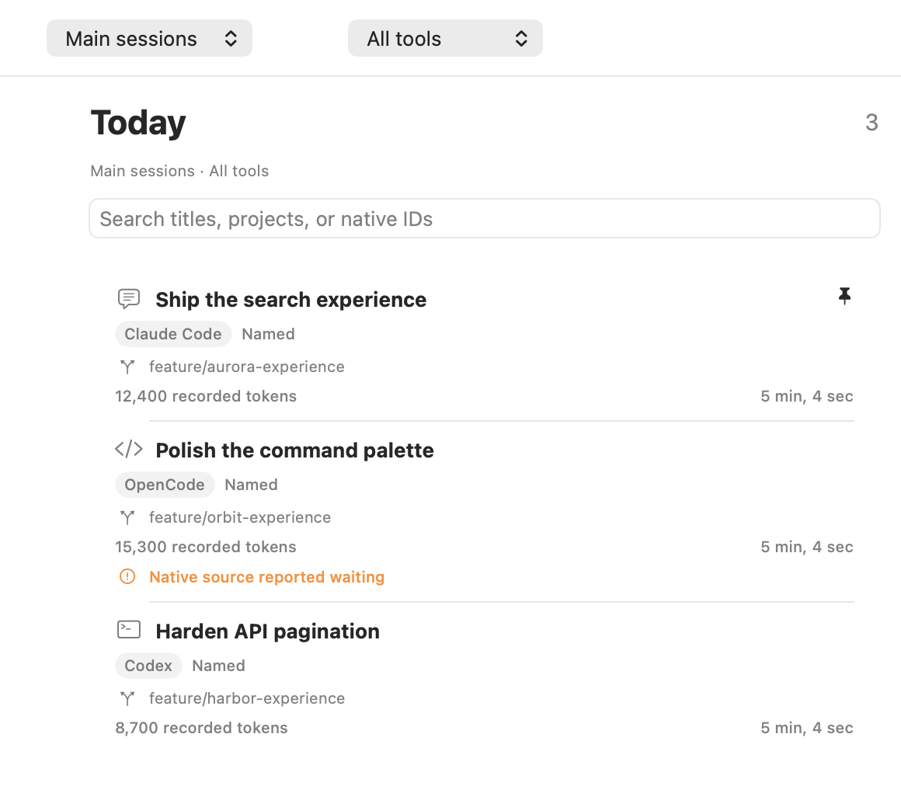

# Conductor

Conductor is a personal, open-source macOS companion for local Claude Code, Codex, and OpenCode sessions. Browse main sessions, inspect child sessions and transcripts, and review recorded usage without handing execution to another agent.

Native tools keep ownership of prompts, permissions, configuration, and orchestration. Conductor reads their local history and maintains its own index. Optional [Compass](https://github.com/rushabh268/compass) integration supplies observed evidence through a dedicated reader connection; it does not prove task completion.



Main-session list, cropped from a synthetic fixture render. The fixture also contains 300 child sessions; those appear when you open a parent's Children tab or change the role filter.

## Requirements

- macOS 14 or later.
- For source builds: Xcode with its command-line tools selected, XcodeGen 2.46.0, and Python 3. Build scripts check existing tools and do not install global dependencies.
- For installing a prebuilt app: Python 3 and an extracted, trusted `Conductor.app`.

## Install

From a local checkout, build and install into `~/Applications/Conductor.app`:

```sh
./install.sh
```

Or install an existing app bundle:

```sh
./install.sh --app /absolute/path/to/Conductor.app
```

The same command updates a previous Conductor installation. The installer validates the bundle identity, stages the replacement on the same filesystem, and restores the previous bundle if activation fails. It never opens the app. Quit Conductor before updating, then open it yourself from Finder. App bundles containing symlinks are rejected.

An optional `--destination` must be an absolute path below `~/Applications`, ending in `Conductor.app`. System-wide installation and `sudo` are not supported. Existing `/Applications/Conductor.app` installations are left alone. No release download is required or assumed by these instructions; release archives are available only if someone has separately built and published them.

## Uninstall

```sh
./uninstall.sh
```

This removes the app only and preserves local data and preferences. To explicitly remove the local index as well:

```sh
./uninstall.sh --purge-data
```

Purging removes only `~/Library/Application Support/Conductor`. Native tool history, native settings, Compass state, and macOS preferences are preserved. Supply the same `--destination` when uninstalling a custom installation.

## Connect to Compass

For an existing Compass installation, prepare its dedicated reader connection without changing any coding-tool configuration:

```sh
node /path/to/compass/src/cli.mjs companion-enable --home "$HOME" --state-dir "$HOME/.local/state/compass"
```

Use Compass's supported Node runtime (24.19 or later in the Node 24 line). The command prepares only Compass-owned service files and `reader.key`; it reports whether its running service needs an explicit reload. It never reloads a service or activates native hooks on your behalf. Existing custom service files are refused rather than overwritten.

In Conductor Settings, enter the **absolute** paths to Compass's socket and `reader.key`. Connections can then check read access. The writer key is never an input to Conductor. Open a session's Compass tab to inspect linked evidence. Legacy monthly grounding totals remain unassigned; missing observations do not prove that no work occurred.

## Build and verify

```sh
./scripts/build.sh
./scripts/test.sh
./scripts/package.sh
```

The build is generated from `Conductor/project.yml`; GRDB is pinned in `Conductor/Package.resolved`. Tests use isolated fixtures and a test-mode application host. Packaging produces a ZIP and a portable SHA-256 checksum in `dist/`; the standard Release build includes Apple Silicon and Intel code. These local builds use ad-hoc signing, not Developer ID notarization. The scripts do not disable Gatekeeper or remove quarantine attributes.

## Behavior and privacy

Main-session classification uses native metadata. Unsupported or missing metadata is shown as unknown or unavailable instead of inferred from session names. Usage comes from recorded native values and may be incomplete; it is not a productivity measure. Source format support is covered by fixtures, not a promise that all past or future native versions are supported.

Transcripts stay local unless the user explicitly chooses an export or external action. Conductor does not automatically export raw prompts, install hooks, enable plugins, start native services, or bootstrap Compass. A missing Compass service leaves native browsing available.

See [architecture and data boundaries](docs/architecture.md), [compatibility](docs/compatibility.md), [security](SECURITY.md), and [contributing](CONTRIBUTING.md).

MIT © 2026 Rushabh Sanghvi. This is a personal project.
