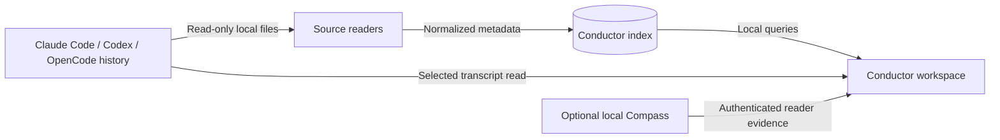

# Architecture and data boundaries

Conductor is a SwiftUI macOS application with a local GRDB/SQLite index. Source adapters normalize native session metadata into common identities, relationships, activity, and usage. The UI reads that index and loads selected transcript detail on demand.

Native source/profile and session ID define identity. Explicit native parent metadata defines child relationships. Unknown role is distinct from a main session, and a missing parent is not evidence that a child is a root. Main sessions are the default population; child detail belongs under its parent. Own-session usage and descendant usage need separate scope so already aggregated totals are not counted twice.

Source readers never repair or migrate native databases. A missing database, unavailable field, incompatible schema, or partial transcript is a reader health condition. Conductor writes only its own state, including its index in `~/Library/Application Support/Conductor` and application preferences.

Compass is an optional separate process. Its dedicated reader API supplies metadata-only evidence tied to native identities and immutable snapshots. Reader credentials do not grant ledger writes. A missing connection, unsupported protocol, or unverifiable evidence remains explicitly unavailable. Evidence reports observed events; an empty stream does not establish completion or failure. Native transcripts are not sent to Compass.

Opening a session in its native tool is an explicit user action. Conductor does not submit prompts, spawn subagents, alter native permissions, activate hooks, or start/configure Compass. Installers copy only the application bundle; uninstallers preserve data unless the user explicitly requests the documented purge.
